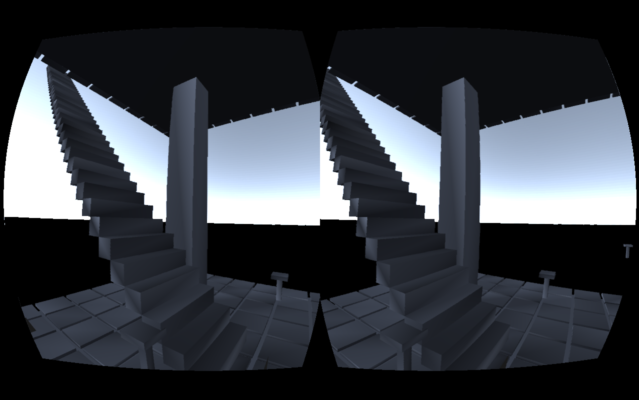

Construct 
==========

Core GUI
----------
Everything should be controllable with head-tracking.
One of important features is text input, and we use dasher for that.

Robustness
----------
No inside action should cause lag or freeze.

Proper Object Model
----------
By default, objects communicates by touching each other. This encourages
visualization of internal objects.

Distant communication is done via JSON (similar to actor model) and not
direct method call, so that no-freeze can be enforced.

Code Simplicity
----------
Use minimum amount of code and data that feels good enough.

License
----------
The code is licensed under FreeBSD.

(Especially) LibOVR has different license; see LibOVR/LICENSE.txt

Dependency
----------
See .travis.yml file for (ubuntu) package names.

Example "Apps"
----------
Impl of Dasher (Eye-cursor only input method developed by some researchted).
In construct, implemented using NativeScript + in-scene quad + very basic English language model.

